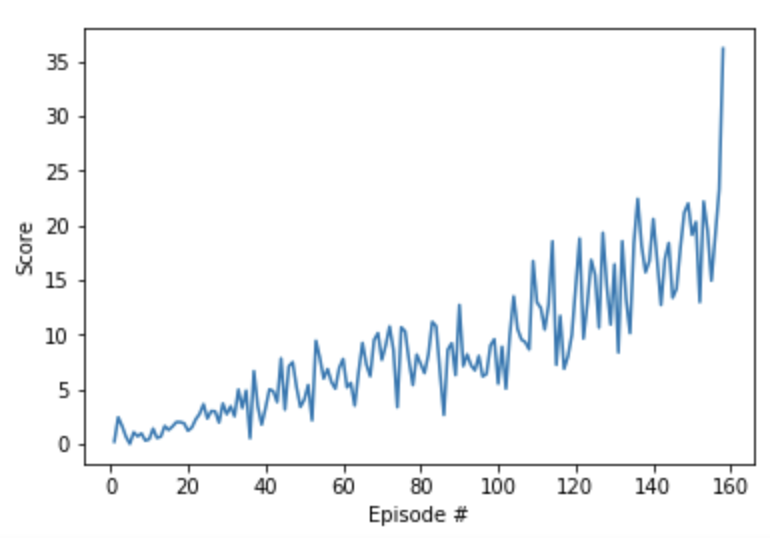

# Banana Navigation

## Table of Contents  

[Algorithm](#First)

[Hyperparameters](#Hyperparameters)

[Rewards](#Rewards)

[Future Work](#Future_Work)  

In this environment, a double-jointed arm can move to target locations. A reward of +0.1 is provided for each step that the agent's hand is in the goal location. Thus, the goal of your agent is to maintain its position at the target location for as many time steps as possible.

The observation space consists of 33 variables corresponding to position, rotation, velocity, and angular velocities of the arm. Each action is a vector with four numbers, corresponding to torque applicable to two joints. Every entry in the action vector must be a number between -1 and 1.

<a name="First"></a>
## Algorithm

We have used the Actor and Critic models and they are defined in the `model.py` file.

The Actor network is built with two fully connected layers with 256 and 128 units with relu activation and tanh activation for the action space. On the other hand, the Critic network has two fully connected layers with 256 and 128 units with leaky_relu activation.

<a name="Hyperparameters"></a>
## Hyperparameters:

The hyperparameters are:

- BUFFER_SIZE (int): replay buffer size
- BATCH_SIZ (int): mini batch size
- GAMMA (float): discount factor
- TAU (float): for soft update of target parameters
- LR_ACTOR (float): learning rate for optimizer
- LR_CRITIC (float): learning rate for optimizer
- WEIGHT_DECAY (float): L2 weight decay

Where
```
- BUFFER_SIZE = int(1e5)
- BATCH_SIZ = 128
- GAMMA = 0.99
- TAU = 1e3
- LR_ACTOR = 2e-4
- LR_CRITIC = 2e-4
- WEIGHT_DECAY = 0.0
```


`BUFFER_SIZE = int(1e5)`, `BATCH_SIZE = 128`, `GAMMA = 0.99`, `TAU = 1e-3`, `LR_ACTOR = 2e-4`, `LR_CRITIC = 2e-4` and `WEIGHT_DECAY = 0.0`.

<a name="Rewards"></a>
## Rewards
We have trained the Agent using the Actor and Critic network, as input we have used the vector of state, we can observe the evolution of the reward along of the episodes. Below is the graphic:



<a name="Future_Work"></a>
## Future Work
Reinforcement Learning has proven its worth in approximating real-world environments. It can help solve many problems that and with the combination of deep learning and RL, we’re much closer to solving these problems.

We have thought in the next steps to improve our algorithm:

  1. Parallel agent training

  2. Gradient clipping

  3. More layers or dropouts in the agent
